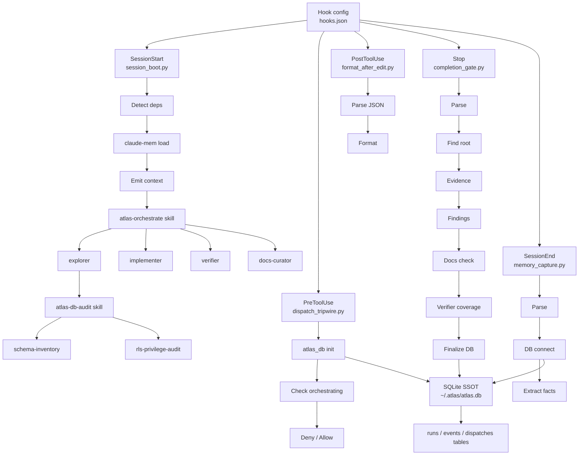

# Atlas Plugin Architecture Map - 2026-07-17

Produced by `atlas-audit architecture`. Three read-only explorers (orchestration engine, repo boundaries, MCP servers) mapped the tree; this is the synthesis. Input for the graphify wiki pipeline (`docs/architecture/` -> `docs/wiki/diagrams/`).

## Orchestration engine (hook -> DB -> subagent flow)

Key facts:
- SQLite SSOT schema at `atlas_db.py:11-86`; DB at `~/.atlas/atlas.db` (or `$ATLAS_DB`). Tables: `runs`, `events`, `dispatches`.
- Skills wire to agents by agent-type name in SKILL.md (e.g. atlas-db-audit -> schema-inventory / rls-privilege-audit / explorer).
- `session_boot` is fail-open throughout (any error exits 0). `completion_gate` is fail-closed on verifier/git checks but fail-open on structure checks. (The CODE audit flags several fail-open branches as contradicting their own comments.)

## Repo feature boundaries

- **Root `/skills/` (12 standalone tools):** az-cost-optimize, azure-deployment-preflight, cloud-design-patterns, codebase-brain, database-optimization, entra-agent-user, graphify, msgraph-sdk, msoffice-docs, scrapling-official, security-audit, webapp-testing. All target external domains (Azure, MS APIs, security, web).
- **`/plugins/atlas/` (the plugin):** 20 atlas-* skills + 12 agents + 10 hooks + scripts. Atlas-specific operations (audit, debug, orchestrate).
- **`/plugins/armada/` (org config layer):** 11 department agents carrying org branding/compliance context + the armada routing skill.
- **`/plugins/programmer/` (independent developer-tools plugin, added 2026-07-21):** 2 skills (tpp-audit, tpp-principles) + 1 agent (tpp-auditor) + 1 UserPromptSubmit hook. Pragmatic Programmer codebase auditor with an 89-concept glossary; not part of the atlas orchestration engine.
- **`/plugins/_standards/`, `/plugins/_templates/`:** scaffolding docs and skill/command/agent/plugin templates.
- **`/mcp_servers/`:** per-vendor MCP servers (auvik, cipp, connectwise-manage, vanta, knowbe4, ...).

## Duplication findings (candidates for unification)

| Concern | Sites | Note |
|---|---|---|
| JSON-stdin parse boilerplate | 8 hooks: bash_advisor, completion_gate, dispatch_tripwire, format_after_edit, ingest_session, memory_capture, nudge, prompt_optimizer | Identical `stdin.read()` -> `json.loads or {}` -> `except: return 0`. Extract one `read_hook_input()` helper. |
| Root-finding (walk up to `docs/`) | `completion_gate.py:54-70`, `session_boot.py:164-180` | Same upward-walk, two names (`_find_root` vs inside `find_structure`). |
| atlas_db bootstrap (sys.path + connect + init) | `dispatch_tripwire.py:122-134`, `completion_gate.py:390-408`, `memory_capture.py:216` | No shared bootstrap; each hook re-injects `scripts/` on sys.path and re-inits. One `atlas_db.bootstrap()` would centralize it. |
| MCP-server shell / `DomainHandler` interface | copied per server, `vanta` vs `knowbe4` have DRIFTED | The whole MCP-server shell is duplicated and the copies diverge. Highest-risk duplication: drift means per-server behavior differences. Candidate for a shared `mcp_servers/_shared` (note: that dir was just deleted in `56d1a9f`, breaking auvik - see CODE audit H7; the unification target must be rebuilt, not assumed present). |

M365 coverage duplication (previously `armada/agents/armada-m365.md` vs `atlas/skills/atlas-m365/SKILL.md`) is resolved: `atlas-m365` was deleted 2026-07-21 (see docs/CHANGELOG.md), leaving `armada-m365.md` as the sole M365 coverage.

## Simplest unification proposal

1. **One `hooklib.py` in `plugins/atlas/hooks/`** exporting `read_hook_input()`, `find_repo_root()`, and `db_bootstrap()`. Collapses the top three duplication rows across all hooks; smallest diff with the largest dedup.
2. **Rebuild a single MCP `_shared`** (error-envelope, base-url, response-shaper, DomainHandler) and repoint every server at it, reconciling the vanta/knowbe4 drift to one definition. This also fixes CODE-audit H7 (auvik dangling import). Do these together.
3. Leave the root-skills / atlas-plugin / armada three-layer split as-is - it is a real boundary (external tools vs atlas ops vs org governance), not accidental duplication.
